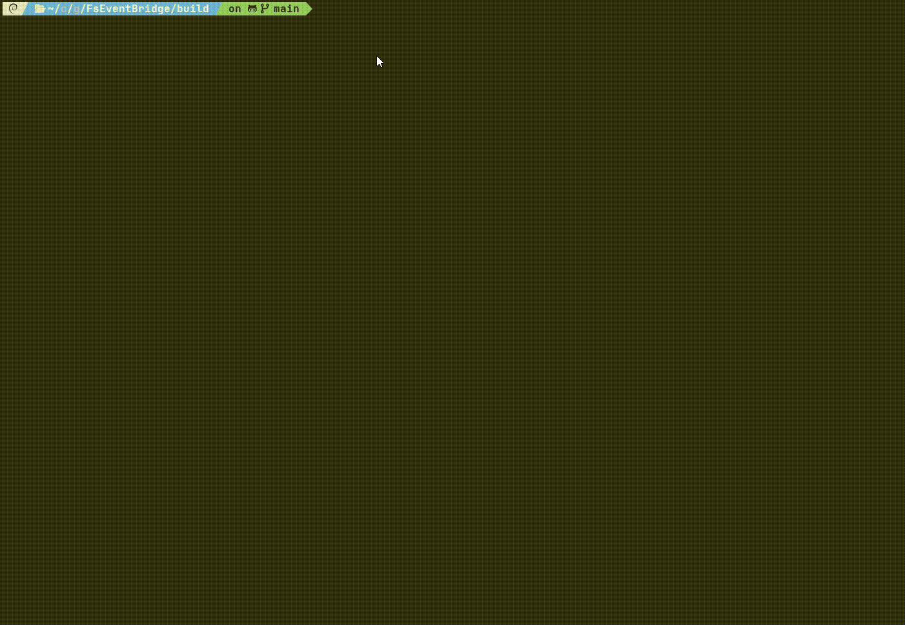

<div align="center">

[](https://github.com/cuilan/FsEventBridge/actions/workflows/ci.yml)
[](https://github.com/cuilan/FsEventBridge/actions/workflows/release.yml)
[](https://opensource.org/licenses/Apache-2.0)


[](https://github.com/cuilan/FsEventBridge/tree/main/tests/README.md)

[](https://github.com/cuilan/FsEventBridge/stargazers)
<a href="https://github.com/cuilan/FsEventBridge"></a>
<a href="https://github.com/cuilan/FsEventBridge/releases"></a>

**FsEventBridge** turns Linux kernel file-system notifications into **NDJSON**, delivered over **Unix Domain Sockets**.

**CLI binary:** `fseventbridge` · **short name:** `feb` (symlink when packaged).

**简体中文（项目首页）：** [README.md](../README.md) · **[Documentation index](./README.md)**

</div>

---

## Demo

Screen recording: files are created/edited under a watched directory and **NDJSON** lines appear on the UDS (**root** or **`CAP_SYS_ADMIN`** required). See also `tests/test_client.py`.



---

## Core features

- **Kernel-level coverage:** Uses **`fanotify`** with **`FAN_MARK_FILESYSTEM`** on the filesystem that contains the anchor path, then applies a **user-space logical filter** (**anchor subtree**, **`recursive` / `--no-recursive`**) before emitting on the socket. Actual events depend on kernel and mount type (see NFS note below).
- **NFS client mounts:** No server-side changes. Whether events appear on an NFS **client** mount depends on the **Linux kernel and NFS client stack**. This project does **not** implement a separate “NFS protocol” path; treat coverage as **best-effort** vs local block filesystems—validate on your kernel (see `DEVELOPMENT_PLAN.md`).
- **C17 + strict warnings:** ISO C17, `-Wall -Wextra -Werror`, `_GNU_SOURCE` for Linux APIs.
- **Performance direction:** `fanotify` + compact NDJSON; **`liburing`** linked and optionally initialized—**async hot path** is roadmap **Milestone 2**.
- **Polyglot clients:** One JSON object per line over a UDS.
- **Operations:** **`sd_notify`** for systemd; **`.deb` / `.rpm`** via CPack/GitHub Releases.
- **IPC hardening:** Non-blocking **`send`**, per-connection queues (**`[ipc]`** knobs), **`poll`** over fanotify/listen/slow **`POLLOUT`**, periodic **`[IPC] stats`** logs.

---

## Build dependencies

- Linux kernel **≥ 5.1** (6.x recommended)
- **GCC ≥ 12** (C17)
- **CMake**, **pkg-config**
- **liburing**, **libsystemd** (+ `-dev`/`-devel` packages for building)

Optional packaging (requires generators on the host):

```bash
bash scripts/build.sh
# or
mkdir -p build && cd build && cmake .. && cmake --build . -j"$(nproc)"
# Packages:
cpack   # emits .deb / .rpm when tools are installed
```

Build output: **`build/fseventbridge`**; **`build/feb`** → symlink (same pattern as **`make install`**).

---

## Runtime privileges (required)

`fanotify` needs **`CAP_SYS_ADMIN`**. Typical options:

- **`sudo ./fseventbridge …`** or **`sudo ./feb …`**
- **Dev shortcut:** `sudo setcap cap_sys_admin+ep ./build/fseventbridge` — reapply after rebuilds so you can run unprivileged binaries.
- **Packaged:** `package/fseventbridge.service` uses **`AmbientCapabilities=CAP_SYS_ADMIN`**.

If you see **`Operation not permitted`**, it often means missing capability or restrictive container/kernel policy—not necessarily an application logic bug.

---

## Monitoring scope & `recursive`

The kernel path still uses **`FAN_MARK_FILESYSTEM`** on the **whole filesystem** that holds **`--dir` / `[monitor].path`**. Before NDJSON hits the socket, **`event_path_in_scope`** keeps only paths **under the anchor**; same-FS paths **outside** the anchor subtree are dropped.

| Layer | Behavior |
|-------|----------|
| Kernel mark | **`FAN_MARK_FILESYSTEM`** — entire FS instance containing the anchor. |
| Logical filter | Only paths under the anchor proceed; siblings on the same volume are skipped. |
| **`recursive=true`** (default TOML; **`-r` / `--recursive`** forces true from CLI) | Full subtree below the anchor (**`exclude_*`** still apply afterward). |
| **`recursive=false`** (**`--no-recursive`**) | Anchor path plus **immediate entries** only—no deeper paths like `./subdir/file`. |
| Paths | Prefer **absolute** paths—matches systemd units and avoids CWD ambiguity. |
| **`--check-config`** | Prints **`logical_scope`** (`subtree` / `direct_children`) and **`logical_scope_explained=…`** (English one-liner summarizing FS mark → anchor filter → **`exclude_*`**). Runs **without root**. |

Containers, **WSL2**, and **`user.namespaces`** may further restrict **`fanotify`**—validate where you deploy.

---

## CLI quick reference

```bash
sudo ./fseventbridge -d /data/logs -s /tmp/feb.sock -l debug -r
```

| Flag | Purpose |
|------|---------|
| `-d`, `--dir` | Anchor directory |
| `-s`, `--socket` | UDS path (default `/tmp/feb.sock`) |
| `-c`, `--config` | TOML file |
| `-r`, `--recursive` | Logical **full subtree** under anchor |
| `--no-recursive` | Anchor + **one level** only |
| `-l`, `--log-level` | `debug` / `info` / `warn` / `error` |
| `-e`, `--exclude-ext` | Drop by extension (repeatable) |
| `-x`, `--exclude-path` | Drop by path prefix (repeatable) |
| `-i`, `--io-uring` | Turn on io_uring setup |
| `--no-io-uring` | Turn it off |
| `--check-config` | Dry-run resolved config (includes **`logical_scope`**) |
| `-v`, `--version` | Version |

**CLI overrides config** after TOML is loaded.

Installed layout: **`fseventbridge -c /etc/fseventbridge/config.toml`**, unit **`fseventbridge.service`**. The product name **FsEventBridge** is used in docs; the command is always lowercase **`fseventbridge`** / **`feb`**.

---

## Example `config.toml`

See [`configs/config.toml`](../configs/config.toml). Minimal shape:

```toml
[server]
socket_path = "/tmp/feb.sock"
log_level = "info"

[monitor]
path = "/data/app"
recursive = true
events = ["CLOSE_WRITE"]
exclude_extensions = [".tmp", ".swp"]
exclude_paths = ["/data/app/cache"]

[processor]
use_io_uring = true

[ipc]
per_client_queue_max_bytes = 262144
on_queue_full = "disconnect"
```

---

## NDJSON event fields

Start **`fseventbridge`**, connect to the same socket, read **one JSON object per line**. Reference clients: **`tests/test_client.py`**, **`tests/test_client.go`**.

| Field | Meaning |
|-------|---------|
| `path` | File path |
| `event` | Human-readable name (e.g. `CLOSE_WRITE`, `MODIFY`) |
| `type` | Integer enum aligned with `event` (`UNKNOWN` = 0) |
| `size` | File size in bytes |
| `ts` | Gateway observation time (**Unix seconds**, `CLOCK_REALTIME`) after metadata read |
| `mtime` | `st_mtim` seconds, or **`-1`** if `fstat` failed |
| `mask` | Raw fanotify mask (compare with `FAN_*` constants) |

---

## Go client sketch

```go
conn, _ := net.Dial("unix", "/tmp/feb.sock")
scanner := bufio.NewScanner(conn)

for scanner.Scan() {
    var event MyFileEvent
    json.Unmarshal(scanner.Bytes(), &event)
    handlePath(event.Path)
}
```

---

## Tests

```bash
bash tests/run.sh --milestone 0 --type unit
sudo -E bash tests/run.sh --milestone 0 --type e2e
sudo -E bash tests/run.sh --milestone 1 --type e2e
sudo -E bash tests/run.sh --milestone 3 --type e2e
sudo -E bash tests/run.sh --milestone 4 --type e2e
```

Details: [`tests/README.md`](../tests/README.md). Roadmap: [`DEVELOPMENT_PLAN.md`](../DEVELOPMENT_PLAN.md).

---

## License

**Apache-2.0** — see the [license badge](https://opensource.org/licenses/Apache-2.0) or your distribution’s `copyright` / upstream metadata.
